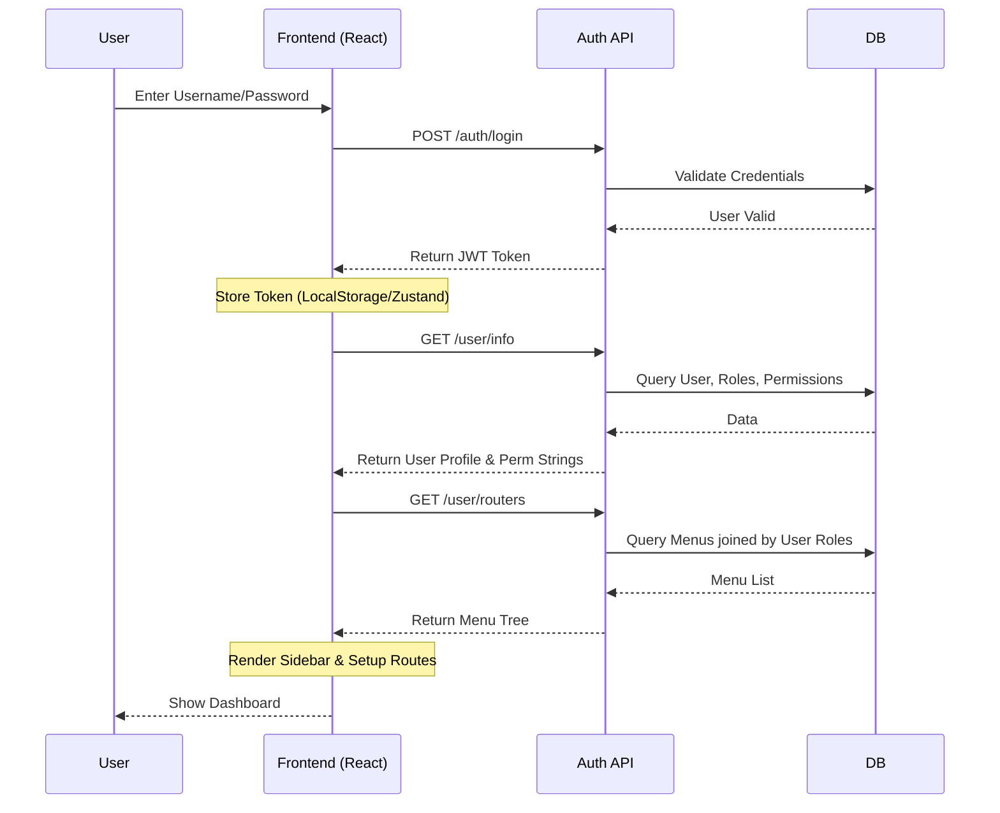

# Permission & Menu Control System Design Document

## 1. Overview
This document details the design for the Permission and Menu Control module for the Quality Control (QC) System.
**Goal**: Replace the current hardcoded frontend role logic with a dynamic, database-driven Role-Based Access Control (RBAC) system.

**Tech Stack**:
- **Frontend**: React.js (with Ant Design)
- **Backend**: Java Spring Boot
- **Database**: PostgreSQL

---

## 2. Database Design (PostgreSQL)

We will use a standard RBAC model with five core tables.

### 2.1 ER Diagram Concept
`sys_user` >--< `sys_user_role` >-- `sys_role` >-- `sys_role_menu` >-- `sys_menu`

### 2.2 Table Definitions

#### `sys_user` (Users)
Stores user account information.
| Field | Type | Description |
|---|---|---|
| `user_id` | BIGINT (PK) | Unique ID |
| `username` | VARCHAR(50) | Login username |
| `password` | VARCHAR(100) | Encrypted password |
| `real_name` | VARCHAR(100) | Display name |
| `email` | VARCHAR(100) | Email address |
| `avatar` | VARCHAR(255) | URL to avatar image |
| `status` | INT | 1: Enabled, 0: Disabled |
| `dept_id` | BIGINT | Department ID |
| `manager_id` | BIGINT | Line Manager ID |

#### `sys_role` (Roles)
Stores role definitions (e.g., Admin, M1, M2, Staff).
| Field | Type | Description |
|---|---|---|
| `role_id` | BIGINT (PK) | Unique ID |
| `role_name` | VARCHAR(50) | Role Name (e.g., "Manager L1") |
| `role_key` | VARCHAR(50) | Code (e.g., "M1", "admin") |
| `status` | INT | 1: Enabled, 0: Disabled |

#### `sys_menu` (Menus & Permissions)
Stores the tree structure of menus and specific permission buttons.
| Field | Type | Description |
|---|---|---|
| `menu_id` | BIGINT (PK) | Unique ID |
| `menu_name` | VARCHAR(50) | Menu Label (e.g., "Dashboard") |
| `parent_id` | BIGINT | Parent Menu ID (0 for root) |
| `order_num` | INT | Sort Order |
| `path` | VARCHAR(255) | Frontend Route Path (e.g., "/qc/sampling") |
| `component` | VARCHAR(255) | React Component Path |
| `menu_type` | CHAR(1) | 'M': Directory, 'C': Menu Item, 'F': Button/Action |
| `perms` | VARCHAR(100) | Permission identifier (e.g., "qc:sampling:list") |
| `icon` | VARCHAR(100) | Icon Name (e.g., "DashboardOutlined") |
| `visible` | INT | 0: Hidden, 1: Visible |

#### `sys_user_role` (User-Role Association)
| Field | Type | Description |
|---|---|---|
| `user_id` | BIGINT (PK) | FK to sys_user |
| `role_id` | BIGINT (PK) | FK to sys_role |

#### `sys_role_menu` (Role-Menu Association)
| Field | Type | Description |
|---|---|---|
| `role_id` | BIGINT (PK) | FK to sys_role |
| `menu_id` | BIGINT (PK) | FK to sys_menu |

---
### 2.3 Example Data

To illustrate the system, here are example records for a **Staff** (Alice) and a **Manager** (Bob), and the corresponding permission setup.

#### `sys_user` (Data)
| user_id | username | real_name | manager_id | status |
|---|---|---|---|---|
| 1 | admin | System Admin | NULL | 1 |
| 2 | bob | Bob Manager | 1 | 1 |
| 3 | alice | Alice Staff | 2 | 1 |

#### `sys_role` (Data)
| role_id | role_name | role_key |
|---|---|---|
| 1 | Administrator | admin |
| 2 | QC Manager | manager |
| 3 | QC Staff | staff |

#### `sys_menu` (Data - Simplified)
| menu_id | menu_name | parent_id | path | menu_type | perms |
|---|---|---|---|---|---|
| 1 | Dashboard | 0 | /dashboard | C | `dashboard:view` |
| 10 | QC Management | 0 | /qc | M | - |
| 11 | Sampling | 10 | sampling | C | `qc:sampling:list` |
| 12 | My QC Actions | 10 | my-actions | C | `qc:action:list` |
| 13 | Dispute Resolution | 10 | dispute | C | `qc:dispute:list` |
| 111 | Button: Assign | 11 | - | F | `qc:sampling:assign` |
| 112 | Button: Verify | 11 | - | F | `qc:sampling:verify` |

#### `sys_user_role` (Data)
| user_id | role_id |
|---|---|
| 1 (Admin) | 1 (Admin) |
| 2 (Bob) | 2 (Manager) |
| 3 (Alice) | 3 (Staff) |

#### `sys_role_menu` (Data)
*Defining what each role can see.*

**Role: Manager (ID: 2)**
- Can see Dashboard (1)
- Can see QC Management (10)
- Can see Sampling (11) + Assign (111) + Verify (112)
- Can see My Actions (12)
- Can see Dispute (13)

**Role: Staff (ID: 3)**
- Can see Dashboard (1)
- Can see QC Management (10)
- Can see My Actions (12)
- *Cannot see Sampling or Dispute*

| role_id | menu_id |
|---|---|
| 2 | 1, 10, 11, 111, 112, 12, 13 |
| 3 | 1, 10, 12 |

---

## 3. API Design (Spring Boot)

All responses follow a standard wrapper:
```json
{
  "code": 200,
  "msg": "Success",
  "data": { ... }
}
```

### 3.1 Authentication
**POST** `/api/auth/login`
- **Request**:
  ```json
  {
    "username": "admin",
    "password": "password123" // Processed by BCrypt
  }
  ```
- **Response**:
  ```json
  {
    "token": "eyJhGciOiJIUzUxMi...", // JWT Token
    "expireTime": 3600
  }
  ```

### 3.2 User Info & Permissions
**GET** `/api/user/info`
- **Headers**: `Authorization: Bearer <token>`
- **Description**: Returns user profile, assigned roles, and set of permission strings for button-level control.
- **Response**:
  ```json
  {
    "user": {
      "userId": 1,
      "username": "alice",
      "realName": "Alice Staff",
      "avatar": "..."
    },
    "roles": ["staff"],
    "permissions": ["qc:my-action:list", "dev-plan:view"]
  }
  ```

### 3.3 Dynamic Menu Router
**GET** `/api/user/routers`
- **Description**: Returns the menu tree specifically allowing the user to view. Used to generate the sidebar.
- **Response**:
  ```json
  [
    {
      "name": "Dashboard",
      "path": "/dashboard",
      "icon": "DashboardOutlined",
      "children": []
    },
    {
      "name": "QC Module",
      "path": "/qc",
      "icon": "FileProtectOutlined",
      "children": [
        {
          "name": "My QC Action",
          "path": "my-qc-action",
          "component": "qc/MyQCAction", // Frontend component mapping key
          "meta": { "title": "My QC Action", "icon": "file" }
        }
      ]
    }
  ]
  ```

### 3.4 Frontend Handling: Menu vs. Routes
A common pattern to handle both Navigation and Routing:

1.  **Menu/Sidebar (Tree)**: Uses `children` nesting. This maps directly to Ant Design's `<Menu items={tree} />` structure, allowing for collapsible submenus.
    -   *Why not flat?* A flat list would require the frontend to reconstruct the hierarchy for the UI, adding unnecessary complexity to the client.
2.  **Router (Flat)**: The `path` field is used for Routing. The frontend typically creates a recursive function to flatten the menu tree into a list of `<Route>` components. 
    -   *Example*: `/qc` (Layout) -> `/qc/sampling` (Page), `/qc/my-action` (Page).


---

## 4. Sequence Diagrams

### 4.1 Login & Sidebar Bootstrap



---

## 5. Frontend Implementation Guide (React)

### 5.1 Store Update (`useAppStore.ts`)
Replace the mocked `switchRole` logic with real async actions.

```typescript
interface AppState {
    token: string | null;
    userInfo: User | null;
    permissions: string[]; // e.g. ['system:user:add']
    menuTree: MenuItem[]; // From /user/routers
    
    login: (form: LoginForm) => Promise<void>;
    fetchUserInfo: () => Promise<void>;
    fetchRouters: () => Promise<void>;
}
```

### 5.2 Layout Update (`MainLayout.tsx`)
Instead of `const menuItems = [...]`, the layout should:
1. Subscribe to `useAppStore` to get `menuTree`.
2. Map the backend `menuTree` to Ant Design's `Menu` items format.
    - **Icon Mapping**: Create a utility to map string names ("DashboardOutlined") to actual Ant Design components.
    
**Example Icon Mapper:**
```tsx
const iconMap: Record<string, React.ReactNode> = {
    DashboardOutlined: <DashboardOutlined />,
    FileProtectOutlined: <FileProtectOutlined />,
    // ...
};
```

### 5.3 Protected Routes
Create a wrapper component `<PrivateRoute />` or check permissions in `useEffect`. If `menuTree` is empty, redirect to login.

```tsx
// Simple permission check hook
const usePermission = (permissionKey: string) => {
    const { permissions } = useAppStore();
    return permissions.includes(permissionKey);
};

// Usage in button
{usePermission('qc:audit:approve') && <Button>Approve</Button>}
```
