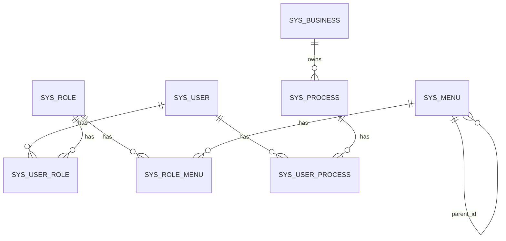

# Permission & Menu Control System Design Document

**Version**: 2.0 (Updated based on actual implementation)  
**Last Updated**: 2025-12-11

## 1. Overview

This document provides a **complete** specification for the Permission and Menu Control module of the Quality Control (QC) System. It is designed to guide developers through implementing a database-driven Role-Based Access Control (RBAC) system.

**System Capabilities**:
- ✅ Dynamic menu rendering based on user roles
- ✅ Hierarchical menu structure (unlimited depth)
- ✅ Role-based access control
- ✅ Efficient tree-building algorithm (O(n))
- ✅ Clean API separation (Auth vs Menu)

**Tech Stack**:
- **Frontend**: React.js + TypeScript + Ant Design
- **Backend**: Java Spring Boot + JPA
- **Database**: PostgreSQL
- **Architecture**: RESTful API with JWT authentication

---

## 2. Database Schema

### 2.1 Entity Relationship Diagram



### 2.2 Table Definitions

#### `sys_user` - User Accounts

| Column | Type | Constraints | Description |
|--------|------|-------------|-------------|
| `id` | UUID | PRIMARY KEY | Unique ID |
| `staff_id` | VARCHAR(50) | UNIQUE, NOT NULL | |
| `staff_name` | VARCHAR(100) | | Display name |
| `email` | VARCHAR(100) | | Email address |
| `status` | INTEGER | DEFAULT 1 | 1=Active, 0=Disabled |
| `manager_id` | UUID | FK to `sys_user(id)` | Line manager reference |
| `created_by` | VARCHAR(50) | | Created by |
| `created_at` | TIMESTAMP | DEFAULT now() | Creation timestamp |
| `updated_by` | VARCHAR(50) | | Updated by |
| `updated_at` | TIMESTAMP | DEFAULT now() | Last update timestamp |

#### `sys_role` - Roles

| Column | Type | Constraints | Description |
|--------|------|-------------|-------------|
| `id` | UUID | PRIMARY KEY | Unique ID |
| `role_name` | VARCHAR(50) | NUNIQUE, NOT NULL | Role identifier (e.g., "admin", "M1", "staff") |
| `role_desc` | VARCHAR(100) | | Role description |
| `status` | INTEGER | DEFAULT 1 | 1=Active, 0=Disabled |
| `created_by` | VARCHAR(50) | | Created by |
| `created_at` | TIMESTAMP | DEFAULT now() | Creation timestamp |
| `updated_by` | VARCHAR(50) | | Updated by |
| `updated_at` | TIMESTAMP | DEFAULT now() | Last update timestamp |

**Important**: When serializing to JSON, the `menus` relationship should use `@JsonIgnore` to avoid data duplication with dedicated menu API.

#### `sys_menu` - Menus & Permissions

| Column | Type | Constraints | Description |
|--------|------|-------------|-------------|
| `id` | BIGSERIAL | PRIMARY KEY | Auto-increment menu ID |
| `menu_name` | VARCHAR(50) | NOT NULL | Menu label (e.g., "Dashboard") |
| `parent_id` | BIGINT | DEFAULT 0 | Parent menu ID (0 = root level) |
| `order_num` | INTEGER | DEFAULT 0 | Display order (ascending) |
| `path` | VARCHAR(255) | | Frontend route path |
| `component` | VARCHAR(255) | | React component path |
| `menu_type` | CHAR(1) | | 'D'=Directory, 'C'=Menu, 'F'=Button |
| `perms` | VARCHAR(100) | | Permission string (e.g., "qc:sampling:list") |
| `icon` | VARCHAR(100) | | Ant Design icon name (e.g., "DashboardOutlined") |
| `visible` | INTEGER | DEFAULT 1 | 1=Visible, 0=Hidden |
| `created_at` | TIMESTAMP | DEFAULT now() | Creation timestamp |

**Menu Types**:
- **D** (Directory): Parent menu with children (e.g., "QC Module")
- **C** (Component): Clickable menu item (e.g., "Sampling")
- **F** (Function): Button-level permission (e.g., "Approve")

#### `sys_user_role` - User-Role Association

| Column | Type | Constraints | Description |
|--------|------|-------------|-------------|
| `user_id` | UUID | PRIMARY KEY, FK | References sys_user(id) |
| `role_id` | UUID | PRIMARY KEY, FK | References sys_role(id) |

**Composite Primary Key**: (`user_id`, `role_id`)

#### `sys_role_menu` - Role-Menu Association

| Column | Type | Constraints | Description |
|--------|------|-------------|-------------|
| `role_id` | UUID | PRIMARY KEY, FK | References sys_role(id) |
| `menu_id` | UUID | PRIMARY KEY, FK | References sys_menu(id) |

**Composite Primary Key**: (`role_id`, `menu_id`)


#### `sys_business` - Business Units

| Column | Type | Constraints | Description |
|--------|------|-------------|-------------|
| `id` | UUID | PRIMARY KEY | Unique ID |
| `biz_code` | VARCHAR(50) | UNIQUE, NOT NULL | Business unit code (e.g., COL, UWS, etc.) |
| `biz_name` | VARCHAR(100) | NOT NULL | Business unit name (e.g., Collections, etc.) |
| `status` | INTEGER | DEFAULT 1 | 1=Active, 0=Disabled |
| `created_at` | TIMESTAMP | DEFAULT now() | Creation timestamp |

#### `sys_process` - Process lines under Business

| Column | Type | Constraints | Description |
|--------|------|-------------|-------------|
| `id` | UUID | PRIMARY KEY | Unique ID |
| `business_id` | UUID | PRIMARY KEY, FK | References sys_business(id) |
| `proc_aid` | VARCHAR(50) | NOT NULL | Process Aid (e.g., "NHI25") |
| `proc_name` | VARCHAR(100) | NOT NULL | Process name (e.g., "Collections Onshore") |
| `qlty_target` | INTEGER | DEFAULT 95 | Quality target percentage |
| `status` | INTEGER | DEFAULT 1 | 1=Active, 0=Disabled |
| `created_by` | VARCHAR(50) | | Created by |
| `created_at` | TIMESTAMP | DEFAULT now() | Creation timestamp |
| `updated_by` | VARCHAR(50) | | Updated by |
| `updated_at` | TIMESTAMP | DEFAULT now() | Last update timestamp |

#### `sys_user_process` - User-Process Association

| Column | Type | Constraints | Description |
|--------|------|-------------|-------------|
| `user_id` | UUID | PRIMARY KEY, FK | References sys_user(id) |
| `process_id` | UUID | PRIMARY KEY, FK | References sys_process(id) |

**Composite Primary Key**: (`user_id`, `process_id`)

---

## 3. API Specification

All APIs use standard REST conventions with JSON request/response bodies.

### 3.1 Authentication APIs

#### GET `/api/auth/info`

**Purpose**: Get current user information and roles

**Query Parameters**:
- `username` (string, required): Username to lookup

**Request Example**:
```http
GET /api/auth/info?username=admin
```

**Response** (200 OK):
```json
{
  "id": "e277662d-428f-4030-84d4-f167c8a4610f",
  "staffId": "40001",
  "staffName": "admin",
  "email": "admin@example.com",
  "status": 1,
  "managerId": "e277662d-428f-4030-84d4-f167c8a46101",
  "managerName": "Super Manager",
  "roles": [
    {
      "roleId": "29adfeab-0e5d-48ab-85db-64800622053d",
      "roleName": "Admin",
      "roleDesc": "Administrator",
      "status": 1,
      "menuIds": [1, 10, 11]
    }
  ],
  "processes": []
}
```

**Key Points**:
- ✅ Returns user basic information
- ✅ Includes `roles` array with role details
- ❌ **Does NOT** include menus (see dedicated menu API)

---

### 3.2 Menu APIs

#### GET `/api/menu/user/{userId}`

**Purpose**: Get hierarchical menu tree for specific user based on their roles

**Path Parameters**:
- `userId` (string, required): User ID to lookup

**Request Example**:
```http
GET /api/menu/user/e277662d-428f-4030-84d4-f167c8a4610f
```

**Response** (200 OK) - **Hierarchical Tree Structure**:
```json
[
  {
    "menuId": 1,
    "menuName": "Dashboard",
    "parentId": 0,
    "sortOrder": 1,
    "path": "/dashboard",
    "component": "Dashboard",
    "menuType": "C",
    "perms": "dashboard:view",
    "icon": "DashboardOutlined",
    "visible": 1,
    "children": []
  },
  {
    "menuId": 10,
    "menuName": "QC Management",
    "parentId": 0,
    "sortOrder": 3,
    "path": "/qc-module",
    "component": null,
    "menuType": "D",
    "perms": null,
    "icon": "FileProtectOutlined",
    "visible": 1,
    "children": [
      {
        "menuId": 11,
        "menuName": "Sampling",
        "parentId": 10,
        "sortOrder": 1,
        "path": "sampling",
        "component": "qc/Sampling",
        "menuType": "C",
        "perms": "qc:sampling:list",
        "icon": null,
        "visible": 1,
        "children": []
      },
      {
        "menuId": 15,
        "menuName": "Inbox (To QC)",
        "parentId": 10,
        "sortOrder": 2,
        "path": "qc-inbox",
        "component": "qc/SamplingPage",
        "menuType": "C",
        "perms": "qc:inbox:list",
        "icon": null,
        "visible": 1,
        "children": []
      }
    ]
  }
]
```

**Key Points**:
- ✅ Returns **hierarchical tree structure** (not flat list)
- ✅ Backend builds tree using O(n) algorithm
- ✅ Menus already **filtered by user's roles**
- ✅ Sorted by `sortOrder` (recursive)
- ✅ Supports **unlimited depth** (2, 3, 4+ levels)
- `children` array contains nested menus

**Backend Logic**:
1. Get user's role IDs from `sys_user_role`
2. Query menus assigned to those roles from `sys_role_menu`
3. Build hierarchical tree from flat list
4. Sort recursively by `sortOrder`
5. Return tree structure

---

#### GET `/api/menu/list`

**Purpose**: Get all menus (admin only, for management)

**Response** (200 OK):
```json
[
    {
    "menuId": 10,
    "menuName": "QC Management",
    "parentId": 0,
    "sortOrder": 3,
    "path": "/qc-module",
    "component": null,
    "menuType": "D",
    "icon": "FileProtectOutlined",
    "visible": 1,
    "children": []
    },
    {
    "menuId": 15,
    "menuName": "Inbox (To QC)",
    "parentId": 10,
    "sortOrder": 2,
    "path": "qc-inbox",
    "component": "qc/SamplingPage",
    "menuType": "C",
    "perms": "qc:inbox:list",
    "icon": null,
    "visible": 1,
    "children": []
    },
    {
    "menuId": 151,
    "menuName": "Delete",
    "parentId": 15,
    "sortOrder": 0,
    "path": "qc-inbox",
    "component": "qc/SamplingPage",
    "menuType": "F",
    "perms": "qc:inbox:delete",
    "icon": null,
    "visible": 0,
    "children": []
    }
]
```

**Note**: 
1. Returns **flat list**, NOT tree structure.
2. Includes **all** menus (Visible, Hidden, and Button permissions).
3. Used by Role Management to build the complete permission selection tree.

---

### 3.3 Role Management APIs

#### GET `/api/role/list`
**Purpose**: Get all roles with their menu permissions.
**Response**:
```json
[
  {
    "roleId": "29adfeab-0e5d-48ab-85db-64800622053d",
    "roleName": "Admin",
    "roleDesc": "Administrator full access",
    "status": 1,
    "menuIds": [1, 2, 3, 10, 11] // List of assigned menu IDs, exposed via @JsonProperty getter
  }
]
```

#### POST `/api/role`
**Purpose**: Create a new role.
**Request**:
```json
{
  "roleName": "QC Team Lead",
  "roleDesc": "QC Team Lead permissions",
  "menuIds": [1, 10, 12]
}
```

#### PUT `/api/role/{id}`
**Purpose**: Update role details and permissions.
**Request**:
```json
{
  "roleName": "QC Team Lead",
  "roleDesc": "QC Team Lead permissions",
  "menuIds": [1, 10, 12, 13] // Updated list replaces old one
}
```

#### DELETE `/api/role/{id}`
**Purpose**: Delete a role (only if no users assigned).

---

### 3.4 Process Management APIs

#### GET `/api/process/list`
**Purpose**: Get all processes.
**Response**:
```json
[
  {
    "id": "29adfeab-0e5d-48ab-85db-64800622053d",
    "business": {
      "id": "29adfeab-0e5d-48ab-85db-64800622053d",
      "businessCode": "COL",
      "businessName": "Collection Business Unit"
    },
    "procCode": "COL -- NHI25 -- Collection China Shanghai",
    "procAid": "NHI25",
    "procName": "Collection China Shanghai",
    "qltyTarget": 95,
    "status": 1
  }
]
```

**Note**: `procCode` is a computed field (Business Code + Process Aid + Process Name), not stored in DB.

#### POST `/api/process`
**Purpose**: Create a new process.
**Request**:
```json
{
  "businessId": "29adfeab-0e5d-48ab-85db-64800622053d",
  "procAid": "NHI25",
  "procName": "Collection China Shanghai",
  "qltyTarget": 95,
  "status": 1
}
```

#### PUT `/api/process/{id}`
**Purpose**: Update process details.
**Request**:
```json
{
  "businessId": "29adfeab-0e5d-48ab-85db-64800622053d",
  "procAid": "NHI25",
  "procName": "Collection China Shanghai (Updated)",
  "qltyTarget": 98,
  "status": 0
}
```

#### DELETE `/api/process/{id}`
**Purpose**: Delete a process (only if no users assigned).

---

### 3.5 User Management APIs

#### GET `/api/user/list`
**Purpose**: Get all users with their details.
**Query Parameters**:
- `staffId` (optional): Filter by Staff ID
- `managerId` (optional): Filter by Line Manager ID
**Response** (200 OK - Paginated):
```json
{
  "content": [
    {
      "id": "29adfeab-0e5d-48ab-85db-64800622053d",
      "staffId": "40001",
      "staffName": "Alice Staff",
      "email": "alice@example.com",
      "status": 1,
      "managerId": "29adfeab-0e5d-48ab-85db-648006220531",
      "managerName": "Super Manager",
      "roles": [
        {
          "roleId": "29adfeab-0e5d-48ab-85db-64800622053a",
          "roleName": "Staff",
          "roleDesc": "Staff member",
          "status": 1,
          "menuIds": [10, 11]
        }
      ],
      "processes": [
        {
          "id": "proc-uuid-1",
          "procName": "Collection China"
        }
      ]
    }
  ],
  "totalElements": 1,
  "totalPages": 1,
  "size": 10,
  "number": 0
}
```

#### GET `/api/user/managers`
**Purpose**: Get all users who act as line managers.
**Response**:
```json
[
  {
    "id": "29adfeab-0e5d-48ab-85db-648006220531",
    "staffId": "30001",
    "staffName": "Super Manager",
    "status": 1
  }
]
```

#### POST `/api/user`
**Purpose**: Create a new user.
**Request**:
```json
{
  "staffId": "40001",
  "name": "David Staff",
  "role": "Staff",
  "status": 1,
  "lineManagerId": "29adfeab-0e5d-48ab-85db-648006220531",
  "processes": ["PROC-uuid-1", "PROC-uuid-2"]
}
```

#### PUT `/api/user/{id}`
**Purpose**: Update user information.
**Request**:
```json
{
  "id": "29adfeab-0e5d-48ab-85db-64800622053d",
  "staffId": "40001",
  "name": "Alice Cooper",
  "role": "M1",
  "lineManagerId": "29adfeab-0e5d-48ab-85db-648006220531",
  "processes": ["PROC-001", "PROC-003"]
}
```

#### DELETE `/api/user/{id}`
**Purpose**: Soft delete/deactivate a user.

---

### 3.6 Business Management APIs

#### GET `/api/business/list`
**Purpose**: Get all business units (for dropdowns).
**Response**:
```json
[
  {
    "id": "29adfeab-0e5d-48ab-85db-64800622053d",
    "bizCode": "COLLECTION",
    "bizName": "Collection Business Unit",
    "status": 1
  }
]
```

#### POST `/api/business`
**Purpose**: Create a new business unit.
**Request**:
```json
{
  "bizCode": "COLLECTION",
  "bizName": "Collection Business Unit",
  "status": 1
}
```

#### DELETE `/api/business/{id}`
**Purpose**: Delete a business unit.

---

## 4. Menu Configuration Guide

### 4.1 Adding New Menus

**Step 1**: Insert menu record
```sql
INSERT INTO sys_menu (
    menu_name, parent_id, order_num, path, 
    component, menu_type, perms, icon, visible
) VALUES (
    'New Feature',  -- menu_name
    0,              -- parent_id (0 = root level)
    7,              -- order_num (display order)
    '/new-feature', -- path (frontend route)
    'NewFeature',   -- component (React component)
    'C',            -- menu_type (C = menu item)
    'feature:view', -- perms (permission string)
    'StarOutlined', -- icon (Ant Design icon name)
    1               -- visible (1 = visible)
);
```

**Step 2**: Assign to roles
```sql
-- Assign to admin role (role_id = 1)
INSERT INTO sys_role_menu (role_id, menu_id) 
VALUES (1, <new_menu_id>);

-- Assign to manager role (role_id = 2)
INSERT INTO sys_role_menu (role_id, menu_id) 
VALUES (2, <new_menu_id>);
```

### 4.2 Creating Multi-Level Menus

**Example**: Add 3-level menu structure

```sql
-- Level 1: Parent directory
INSERT INTO sys_menu (menu_name, parent_id, order_num, path, menu_type, icon, visible)
VALUES ('System Settings', 0, 10, '/settings', 'M', 'SettingOutlined', 1)
RETURNING menu_id; -- Returns: 100

-- Level 2: Sub-category
INSERT INTO sys_menu (menu_name, parent_id, order_num, path, component, menu_type, visible)
VALUES ('User Management', 100, 1, 'team-structure', 'TeamManagement', 'C', 1)
RETURNING menu_id; -- Returns: 101

-- Level 3: Specific features
INSERT INTO sys_menu (menu_name, parent_id, order_num, path, component, menu_type, perms, visible)
VALUES ('User List', 101, 1, 'list', 'settings/users/UserList', 'C', 'user:list', 1);

INSERT INTO sys_menu (menu_name, parent_id, order_num, path, component, menu_type, perms, visible)
VALUES ('Add User', 101, 2, 'add', 'settings/users/AddUser', 'C', 'user:add', 1);
```

**Result Structure**:
```
System Settings (L1)
  └─ User Management (L2)
      ├─ User List (L3)
      └─ Add User (L3)
```

### 4.2.1 Adding Button Permissions (Granular Control)

To control specific buttons (e.g., "Delete", "Export") within a page, add them as **Function (F)** type menus. They are children of the page menu but are set to be **invisible** in the navigation.

**Example**: Add "Delete" and "Export" buttons to "User List" page (Menu ID: 101)

```sql
-- 1. "Delete" Button Permission
INSERT INTO sys_menu (menu_name, parent_id, order_num, menu_type, perms, visible)
VALUES ('Delete User', 101, 1, 'F', 'user:delete', 0); -- Visible=0 (Hidden)

-- 2. "Export" Button Permission
INSERT INTO sys_menu (menu_name, parent_id, order_num, menu_type, perms, visible)
VALUES ('Export Data', 101, 2, 'F', 'user:export', 0);
```

**Result Structure with Permissions**:
```
System Settings (Directory)
  └─ User Management (Page)
      ├─ [Visible] User List (Page View) - perms: "user:list"
      ├─ [Hidden]  Delete User (Button)  - perms: "user:delete"
      └─ [Hidden]  Export User (Button)  - perms: "user:export"
```

**Usage**:
- **Sidebar**: Only shows "System Settings > User Management".
- **Role Assignment**: Admin can check "Delete User", while Staff only checks "User List".
- **Frontend Code**: 
  ```tsx
  {hasPerm('user:delete') && <Button>Delete</Button>}
  ```

### 4.3 Complete Role Configuration Example

**Scenario**: Configure menus for "QC Manager" role

```sql
-- 1. Create role
INSERT INTO sys_role (role_name, status)
VALUES ('QC Manager', 1)
RETURNING role_id; -- Returns: <UUID>

-- 2. Assign menus to role
INSERT INTO sys_role_menu (role_id, menu_id) VALUES
(4, 1),   -- Dashboard
(4, 2),   -- My Workspace
(4, 3),   -- Analytics
(4, 10),  -- QC Module (parent)
(4, 11),  -- - Sampling
(4, 14),  -- - Inbox
(4, 15),  -- - Drafts
(4, 16),  -- - Outbox
(4, 17),  -- - Dispute
(4, 18);  -- - History

-- 3. Assign role to user
INSERT INTO sys_user_role (user_id, role_id)
VALUES (5, 4); -- User ID 5 becomes QC Manager
```

### 4.4 Menu Configuration Best Practices

1. **Order Numbers**:
   - Use increments of 1 or 10 for flexibility
   - Leave gaps for future insertions

2. **Path Convention**:
   - Root level: `/path` (leading slash)
   - Sub-levels: `subpath` (no leading slash)
   - Example: `/qc-module` → `sampling`

3. **Icon Names**:
   - Use Ant Design icon names: `DashboardOutlined`, `FileProtectOutlined`
   - Check: https://ant.design/components/icon

4. **Permission Strings**:
   - Format: `module:resource:action`
   - Example: `qc:sampling:list`, `qc:sampling:add`

5. **Menu Types**:
   - Use 'M' for categories with children
   - Use 'C' for clickable menu items
   - Use 'F' for button-level permissions

---

## 5. Backend Implementation

### 5.1 Entity Classes

#### SysMenu.java

```java
@Data
@Entity
@Table(name = "sys_menu")
public class SysMenu {
    @Id
    @GeneratedValue(strategy = GenerationType.IDENTITY)
    @Column(name = "menu_id")
    private Long menuId;
    
    @Column(name = "menu_name", nullable = false)
    private String menuName;
    
    @Column(name = "parent_id")
    private Long parentId;
    
    @Column(name = "order_num")
    private Integer orderNum;
    
    private String path;
    private String component;
    private String menuType;
    private String perms;
    private String icon;
    private Integer visible;
    
    @Column(name = "created_at")
    private LocalDateTime createdAt;
    
    // For tree structure (NOT persisted to database)
    @Transient
    private List<SysMenu> children = new ArrayList<>();
}
```

#### SysRole.java

```java
@Data
@Entity
@Table(name = "sys_role")
public class SysRole {
    @Id
    @GeneratedValue(strategy = GenerationType.AUTO)
    @Column(name = "id")
    private UUID id;
    
    @Column(name = "role_name", nullable = false, unique = true)
    private String roleName;
    
    private String roleDesc;
    private Integer status;
    private LocalDateTime createdAt;
    
    // JsonIgnore prevents menu serialization in /auth/info
    @JsonIgnore
    @ManyToMany(fetch = FetchType.LAZY)
    @JoinTable(
        name = "sys_role_menu",
        joinColumns = @JoinColumn(name = "role_id"),
        inverseJoinColumns = @JoinColumn(name = "menu_id")
    )
    private Set<SysMenu> menus = new HashSet<>();

    // Computed property to expose menu IDs in JSON response
    @JsonProperty("menuIds")
    public Set<Long> getMenuIds() {
        // ... implementation
    }
}
```

### 5.2 Tree Building Algorithm

```java
/**
 * Converts flat menu list to hierarchical tree.
 * Time Complexity: O(n)
 * Space Complexity: O(n)
 */
private List<SysMenu> buildMenuTree(List<SysMenu> flatList) {
    Map<Long, SysMenu> menuMap = new HashMap<>();
    List<SysMenu> roots = new ArrayList<>();
    
    // First pass: Create map and initialize children
    for (SysMenu menu : flatList) {
        menuMap.put(menu.getMenuId(), menu);
        menu.setChildren(new ArrayList<>());
    }
    
    // Second pass: Build parent-child relationships
    for (SysMenu menu : flatList) {
        if (menu.getParentId() == 0 || menu.getParentId() == null) {
            roots.add(menu);
        } else {
            SysMenu parent = menuMap.get(menu.getParentId());
            if (parent != null) {
                parent.getChildren().add(menu);
            }
        }
    }
    
    // Sort all levels by order_num
    sortMenusByOrder(roots);
    
    return roots;
}

/**
 * Retrieves menus by IDs and ensures all parent/ancestor menus are included.
 * Robustness Fix: Handles cases where user has child permission but missing parent.
 */
public List<SysMenu> getMenusWithAncestors(Set<Long> menuIds) {
    // 1. Fetch all reference menus
    // 2. Walk up the tree for each assigned menuId
    // 3. Add any missing parents to the result set
    // 4. Return complete list including ancestors
}

/**
 * Recursively sorts menus by order_num
 */
private void sortMenusByOrder(List<SysMenu> menus) {
    menus.sort(Comparator.comparing(
        SysMenu::getSortOrder,
        Comparator.nullsLast(Comparator.naturalOrder())
    ));
    
    for (SysMenu menu : menus) {
        if (menu.getChildren() != null && !menu.getChildren().isEmpty()) {
            sortMenusByOrder(menu.getChildren());
        }
    }
}
```

### 5.3 Controller Example

```java
@RestController
@RequestMapping("/api/menu")
public class SysMenuController {
    
    @Autowired
    private SysMenuService menuService;
    
    @Autowired
    private SysUserService userService;
    
    @GetMapping("/user/{userId}")
    public ResponseEntity<List<MenuResponseDTO>> getUserMenus(@PathVariable String userId) {
        return userService.findById(UUID.fromString(userId))
            .map(user -> {
                List<SysMenu> flatMenus;
                boolean isAdmin = user.getRoles().stream().anyMatch(r -> "Admin".equals(r.getRoleName()));
                
                if (isAdmin) {
                    flatMenus = menuService.findAll();
                } else {
                    Set<Long> menuIds = user.getRoles().stream()
                        .flatMap(r -> r.getMenus().stream())
                        .map(SysMenu::getMenuId)
                        .collect(Collectors.toSet());
                    flatMenus = menuService.getMenusWithAncestors(menuIds);
                }
                
                List<SysMenu> tree = menuService.buildMenuTree(flatMenus);
                // ... map to DTOs
                return ResponseEntity.ok(dtos);
            })
            .orElse(ResponseEntity.notFound().build());
    }
}
```

---

## 6. Frontend Implementation

### 6.1 Store Setup (Zustand)

### 6.1 Store Setup (Zustand)

```typescript
// Core Interfaces matching backend entities
export interface SysMenu {
    menuId: number;
    menuName: string;
    parentId: number;
    sortOrder: number;
    path: string;
    component?: string;
    menuType: 'D' | 'C' | 'F'; 
    icon?: string;
    children?: SysMenu[];
}

export interface RoleDefinition {
    roleId: string;
    roleName: string;
    roleDesc?: string;
    status: number;
    menuIds: number[];
}

export interface Process {
    id: string;
    procCode: string;
    procAid: string;
    procName: string;
    bizCode: string;
    qltyTarget: number;
    status: number;
}

interface AppState {
    currentUser: User | null;
    menuList: SysMenu[]; // Flat list from API
    roleDefinitions: RoleDefinition[];
    processList: Process[];
    
    // Actions
    login: (username: string) => Promise<void>;
    // ... CRUD actions for Roles, Processes
}

// Store logic simplifies tree building on frontend for some views (Role mgmt),
// but relies on Backend for user menu navigation tree.
```

### 6.2 Menu Rendering (MainLayout)

```typescript
const MainLayout = ({ children }) => {
    const { menuTree } = useAppStore();
    
    // Icon mapping
    const iconMap: Record<string, React.ReactNode> = {
        'DashboardOutlined': <DashboardOutlined />,
        'FileProtectOutlined': <FileProtectOutlined />,
        'TeamOutlined': <TeamOutlined />,
        // ... add all used icons
    };
    
    // Convert backend tree to Ant Design format
    const convertBackendMenu = (items: MenuItem[]): any[] => {
        return items.map((it) => {
            // Remove leading slash from path
            let path = it.path || String(it.menuId);
            if (path.startsWith('/')) {
                path = path.substring(1);
            }
            
            return {
                key: path,
                label: it.menuName,
                icon: it.icon && iconMap[it.icon],
                // Recursively convert children
                children: it.children?.length > 0 
                    ? convertBackendMenu(it.children) 
                    : undefined
            };
        });
    };
    
    const menuItems = menuTree.length > 0 
        ? convertBackendMenu(menuTree) 
        : staticFallbackMenu;
    
    return (
        <Layout>
            <Sider>
                <Menu
                    mode="inline"
                    items={menuItems}
                    onClick={({ key }) => navigate(key)}
                />
            </Sider>
            <Content>{children}</Content>
        </Layout>
    );
};
```

---

## 7. Testing Guide

### 7.1 Backend API Testing

**Test Menu API Returns Tree**:
```bash
# PowerShell
Invoke-WebRequest -Uri "http://localhost:8080/api/menu/user/admin" | 
    Select-Object -ExpandProperty Content | 
    ConvertFrom-Json | 
    ConvertTo-Json -Depth 5

# Expected: Should see "children" arrays nested in response
```

**Test Role Filtering**:
```bash
# Admin should see all menus
GET /api/menu/user/admin

# Staff should see limited menus
GET /api/menu/user/alice
```

### 7.2 Frontend Testing

1. **Login Flow**:
   - Clear localStorage: `localStorage.clear()`
   - Navigate to `localhost:5173`
   - Should show login page
   - Login with different users

2. **Menu Display**:
   - Admin: Should see all menus
   - Manager: Should see manager menus
   - Staff: Should see limited menus

3. **Menu Navigation**:
   - Click all menu items
   - Verify correct page loads

---

## 8. Migration Scripts

### 8.1 Initial Setup (V1)

```sql
-- V1__init_rbac.sql
CREATE TABLE sys_user (...);
CREATE TABLE sys_role (...);
CREATE TABLE sys_menu (...);
CREATE TABLE sys_user_role (...);
CREATE TABLE sys_role_menu (...);

-- Seed data
INSERT INTO sys_role (role_name, status) VALUES
('Admin', 1),
('QC Manager', 1),
('QC Staff', 1);

-- Create admin user
INSERT INTO sys_user (staff_id, staff_name, status) 
VALUES ('40001', 'admin', 1);
```

### 8.2 Complete Menu Setup (V2)

```sql
-- V2__add_complete_menus.sql
-- Clear old associations
DELETE FROM sys_role_menu;

-- Insert all menus with proper hierarchy
INSERT INTO sys_menu (...) VALUES (...);

-- Assign menus to roles
INSERT INTO sys_role_menu (role_id, menu_id) VALUES
(1, 1), (1, 2), (1, 3), ...; -- Admin gets all

INSERT INTO sys_role_menu (role_id, menu_id) VALUES
(2, 1), (2, 2), ...; -- Manager subset

INSERT INTO sys_role_menu (role_id, menu_id) VALUES
(3, 1), (3, 2), ...; -- Staff subset
```

---

## 9. Troubleshooting

### Issue: Menu not displaying after login

**Cause**: Old token in localStorage  
**Solution**: Clear localStorage: `localStorage.clear()`

### Issue: Sub-menus not showing

**Cause**: Backend not returning tree structure  
**Solution**: Verify `buildMenuTree` is called in controller

### Issue: Wrong role displayed

**Cause**: Role mapping incorrect  
**Solution**: Check `normalizeRole` function in frontend

### Issue: Menu data in /auth/info

**Cause**: Missing `@JsonIgnore` on SysRole.menus  
**Solution**: Add `@JsonIgnore` annotation

---

## 10. Future Enhancements

1. **Button-Level Permissions**: Use `menu_type='F'` for fine-grained control
2. **Dynamic Routing**: Generate routes from menu tree
3. **Menu Caching**: Cache menu trees on backend
4. **Permission Strings**: Add permission checking hooks
5. **Menu Editor UI**: Build admin interface for menu management

---

## 11. 字段级权限设计 (Field-Level Permission Design)

针对同一页面在不同状态下，不同角色可编辑项不一致的需求（例如 QC 数据详情页），采用 **“代码定义字段组 (Field Groups) + 数据库关联权限点 (F 菜单)”** 的折中方案。

### 11.1 设计核心：两道锁机制

1.  **第一道锁 (前端控制)**：
    - **原理**：前端根据“用户拥有的权限码”和“记录当前状态”动态禁用或隐藏字段。
    - **目的**：提升用户体验，防止误触。
2.  **第二道锁 (后端校验)**：
    - **原理**：后端在 Update 接口中，根据业务逻辑校验当前角色是否有权修改提交的字段。
    - **目的**：终极安全防线，防止通过脚本或工具绕过前端限制。

### 11.2 具体实现示例 (以 QC 评价为例)

#### 1. 数据库配置 (sys_menu)
在 `sys_menu` 表中为“QC 详情页”创建功能权限点（F）：

| menuId | menuName | parentId | perms | 说明 |
| :--- | :--- | :--- | :--- | :--- |
| 1001 | 编辑-评分评语 | 100 (QC详情页) | `qc:record:eval:edit` | 控制 M1 的评分字段组 |
| 1002 | 编辑-员工回复 | 100 (QC详情页) | `qc:record:staff:edit` | 控制 Staff 的确认字段组 |

#### 2. 前端字段组映射
在前端代码中定义业务逻辑矩阵：

```tsx
const FIELD_GROUPS = {
  MANAGEMENT: {
    perms: 'qc:record:eval:edit',
    validStatus: ['Draft', 'Dispute'], // 仅在草稿或申诉状态可改
    fields: ['score', 'result', 'm1Comments']
  },
  STAFF_CONFIRM: {
    perms: 'qc:record:staff:edit',
    validStatus: ['Wait Staff Confirm'], // 仅在待确认状态可改
    fields: ['staffComments', 'disputeReason']
  }
};
```

#### 3. 后端安全性校验 (伪代码)
```java
public void updateRecord(QCUpdateDTO dto) {
    QCRecord record = repository.findById(dto.getId());
    // 检查评分修改权限
    if (dto.getScore() != null && !user.hasPerm("qc:record:eval:edit")) {
        throw new AccessDeniedException("无权修改评分");
    }
    // 检查业务状态匹配
    if (!"Draft".equals(record.getStatus()) && dto.getScore() != null) {
        throw new AccessDeniedException("当前状态不可修改评分");
    }
}
```

---

## 12. 非菜单 API 权限配置

对于没有对应菜单界面的后台 API（如 `/api/auth/info`），采取以下分类管理策略：

### 12.1 类别 A：基础/公共 API
- **例子**：`/api/auth/info` (获取登录信息), `/api/auth/logout`。
- **配置**：**Login Required Only**。
- **说明**：只要用户已登录且 Token 有效，即可访问。后端无需检查特定的权限字符串。

### 12.2 类别 B：功能配套 API
- **例子**：`/api/user/managers` (下拉列表数据), `/api/role/list` (供角色分配)。
- **配置**：**Map to 'F' Type menu**。
- **说明**：将该权限码挂载到相关页面的菜单节点下，作为功能权限。只有拥有该页面操作权的角色才能调用对应的数据 API。

---

## 13. 总结：RBAC 的精髓

**解耦角色与逻辑**：
不要在代码中使用 `if (role === 'Staff')`。始终使用 `if (hasPermission('qc:edit'))`。
这样管理员就可以在“系统管理”页面自由创建新角色（如 `Temporary_Staff`）并勾选权限点，而无需开发人员修改任何代码。

---

## Appendix A: Complete Menu Configuration Example

See database migration file `V2__add_complete_menus.sql` for production-ready example with all current menus configured.

## Appendix B: API Response Examples

Full response examples are documented in sections 3.1 and 3.2 above.
